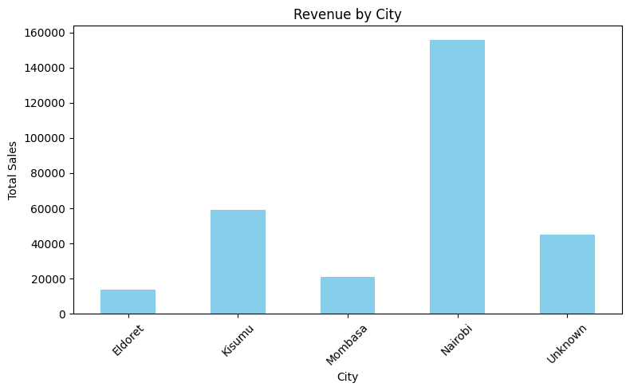
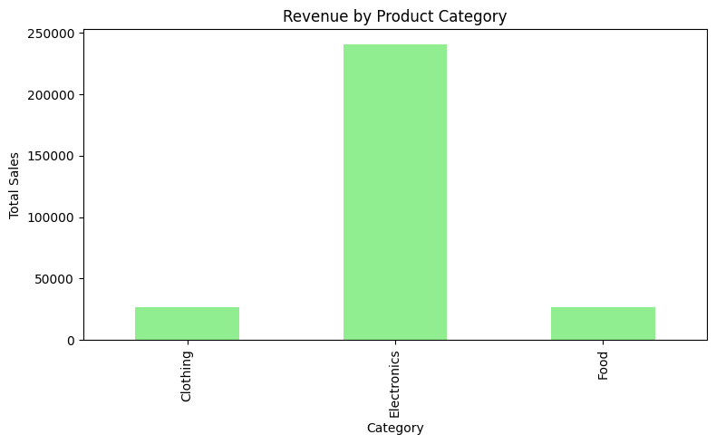
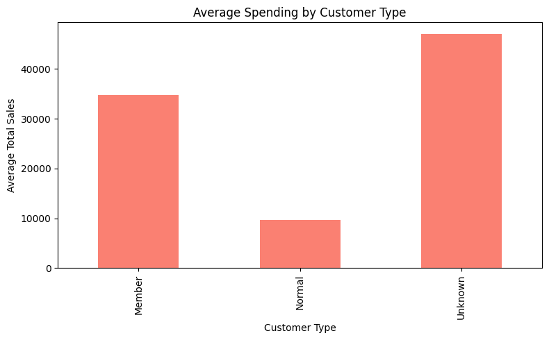

# 🛒 Supermarket Sales Analysis

## 📊 Project Overview
This project analyzes supermarket sales data to identify key business insights such as top-performing cities, product categories, and customer spending behavior.

## 🧹 Data Cleaning
- Handled missing values
- Removed duplicate records
- Created Total_Sales column

## 📈 Analysis
- Revenue by City
- Revenue by Product Category
- Average Spending by Customer Type

## 🔍 Key Insights
- Nairobi generates the highest revenue
- Electronics is the top-performing category
- Missing customer data affects average spending analysis

## 🛠 Tools Used
- Python
- Pandas
- Matplotlib

## 📷 Visualizations
### Revenue by City

### Revenue by Product Category

### Average Spending by Customer Type

## 🚀 Conclusion
This analysis demonstrates how data can be cleaned, analyzed, and visualized to inform business decisions.
